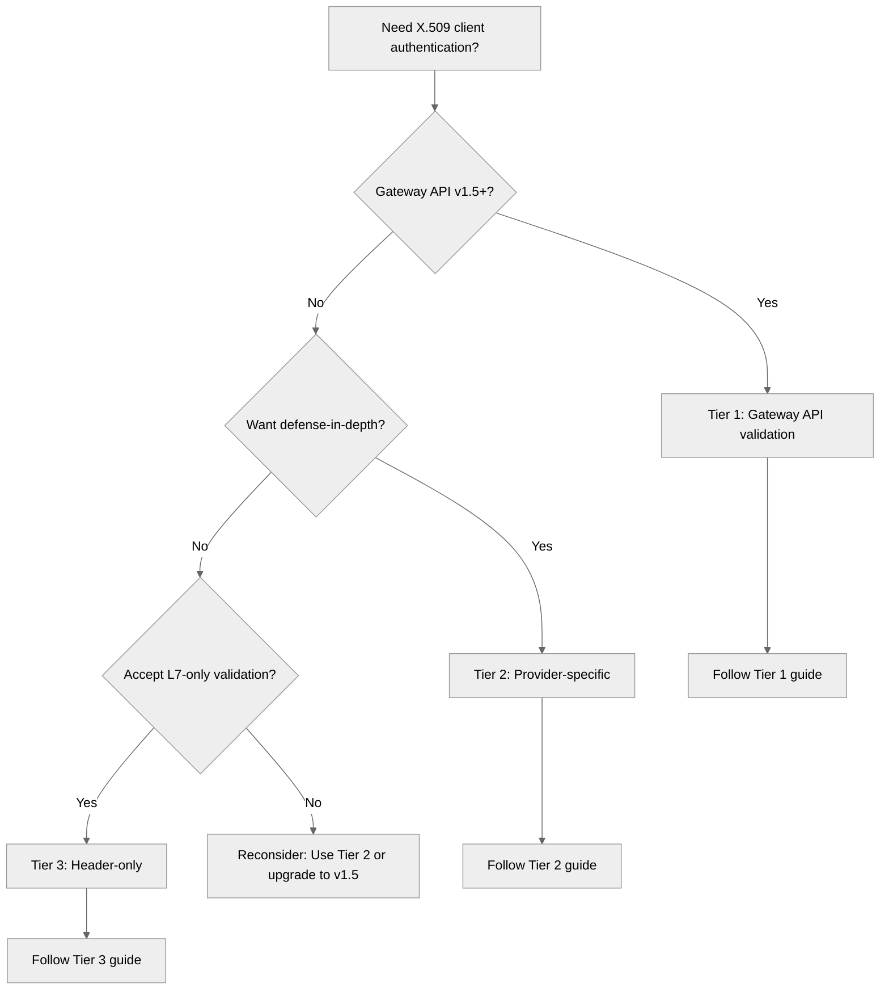

# Authenticate API clients with X.509 certificates

This guide helps you choose and implement the right X.509 client certificate authentication approach for your Gateway API version and security requirements.

For background on when to use X.509 authentication and how Kuadrant's two-layer validation model works, see the [X.509 Authentication Overview](../../overviews/auth-x509.md).

## Choose your configuration approach

Kuadrant supports three configuration tiers. Choose the one that matches your Gateway API version and security requirements:

### Tier 1: Gateway API v1.5+ (Recommended)

**Use this when:** You have Gateway API v1.5+ and a compatible gateway (Istio v1.28+, Envoy Gateway with v1.5 support)

**Security**: ✅ Defense-in-depth (TLS + Application validation) | ✅ Standard Gateway API configuration | ✅ Automatic XFCC header protection

**What you get:**
- Standards-based configuration using Gateway API `spec.tls.frontend.default.validation`
- Automatic header sanitization prevents spoofing
- Cryptographic proof of private key possession

**→ [Follow the Tier 1 guide](x509-tier1-gateway-api-validation.md)**

### Tier 2: Provider-specific resources (Alternative)

**Use this when:** You need defense-in-depth but don't have Gateway API v1.5+ yet

**Security**: ✅ Defense-in-depth (TLS + Application validation) | ⚠️ Provider-specific configuration required

**What you get:**
- Same security guarantees as Tier 1
- Uses EnvoyFilter (Istio) or EnvoyPatchPolicy (Envoy Gateway)
- Clear migration path to Tier 1 when you upgrade

**→ [Follow the Tier 2 guide](x509-tier2-provider-specific.md)**

### Tier 3: Certificate in request header only (Exceptional cases)

**Use this when:** Gateway-level validation is not feasible and you accept L7-only validation

**Security**: ❌ Single validation point (L7 only) | ❌ No cryptographic proof of key possession | ⚠️ Understand the trade-offs

**What you get:**
- L7-only validation through Authorino
- Supports Client-Cert header (RFC 9440) and custom headers
- Works with trusted upstream proxies or when network controls prevent direct access

> [!WARNING] Security warning
> Tier 3 makes Authorino the only layer of protection. Use Tier 1 or Tier 2 whenever possible. If you use Tier 3, ensure you understand the security implications.

**→ [Follow the Tier 3 guide](x509-tier3-header-only.md)**

## Decision tree

## Understanding the tiers

| Feature | Tier 1 | Tier 2 | Tier 3 |
|---------|--------|--------|--------|
| **Defense-in-depth** | ✅ L4 + L7 | ✅ L4 + L7 | ❌ L7 only |
| **Private key proof** | ✅ Yes | ✅ Yes | ❌ No |
| **XFCC protection** | ✅ Automatic | ✅ Manual config | ❌ Depends on deployment |
| **Configuration** | Standard Gateway API | Provider-specific | AuthPolicy only |
| **Prerequisites** | Gateway API v1.5+, Istio v1.28+ | Gateway API any version | Understand security trade-offs |
| **Security level** | Highest | Highest | Lower (single validation point) |

## What's next

After choosing your tier:

1. **Follow the guide**: Each tier has a complete step-by-step walkthrough
2. **Test thoroughly**: Verify both successful and failed authentication scenarios
3. **Add authorization**: Use certificate attributes in authorization rules
4. **Enrich requests**: Inject certificate claims into request headers
5. **Plan CA rotation**: Implement certificate lifecycle management

## See also

- [X.509 Authentication Overview](../../overviews/auth-x509.md) - Deep dive into architecture and security
- [AuthPolicy API Reference](../../reference/authpolicy.md) - Complete API specification
- [Authentication Overview](../../overviews/auth.md) - Compare all authentication methods
- [RFC 0015](https://github.com/Kuadrant/architecture/blob/main/rfcs/0015-x509-client-cert-authpolicy.md) - Design rationale and decisions
